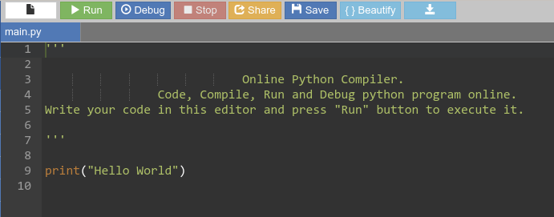

=====================
Introduction à Python
=====================

Qu'est-ce que Python ?
======================

.. figure:: images/Python_logo.png
   :width: 240 px
   :height: 240 px
   :scale: 30 %
   :alt: alternate text
   :align: center

   https://www.python.org/

Créer en 1991 par Guido van Rossum, Python est un langage de programmation très proche du langage algorithme (langage naturel). Cette particularité fait de Python un langage simple à apprendre et à utiliser. Performant, multiplateforme et sous licence libre, il est devenu le langage le plus utilisé au monde (devant C, C++, JAVA, ...) aussi bien dans l'éducation, la recherche et l'industrie.

L'environnement Python est très riche. En plus du langage de base, il existe une multitude de **librairies** (modules) qui apportent à Python des fonctionnalités supplémentaires dans des domaines très variés. Par exemple, avec les trois modules **Numpy**, **Matplotlib** et **Scypi**, le langage Python est devenu une sérieuse alternative à des langages scientifiques comme Matlab ou Scilab.

Python 3.7 est la dernière version stable.

.. warning::
    Il y eu quelques changements notables au passage de Python 2 à Python 3, ce qui fait que ces deux versions ne sont pas compatibles.

Quelle distribution Python choisir ?
====================================

Une distribution Python est un **ensemble de logiciels et de librairies** qui permettent la programmation en langage Python.

Il existe une multitude de distributions Python : Anaconda, EduPython, WinPython, Portable Python, Tiny Python, ...

Anaconda Python
---------------

La distribution **Anaconda Python** est très utilisée par la communauté Python pour plusieurs raisons :

    * multiplateforme (Windows, Linux, Mac OSX) ;
    * bibliothèque étoffée ;
    * outils performants (l'éditeur Spyder et bien d'autres).

.. figure:: images/anaconda_logo-1024x512.png
   :width: 1024 px
   :height: 512px
   :scale: 15 %
   :alt: alternate text
   :align: center

   `<https://www.anaconda.com/distribution/>`_

Anaconda est livré avec l'environnement intégré de développement (IDE) `Spyder <https://www.spyder-ide.org/>`_.

.. image:: images/spyder_fenetre.png
   :width: 1067 px
   :height: 812px
   :scale:  40 %
   :alt: alternate text
   :align: center

L'outil **Spyder** est composé de plusieurs fenêtres dont :

   * **la console IPython** (en bas à droite) dans laquelle les instructions Python vont être interprétées ;
   * **l'éditeur de programme** (à gauche) dans lequel les instructions sont écrites puis enregistrées avec l'extension ``.py``. Ce type de fichier s'appelle un **script** Python.

EduPython
---------

.. figure:: images/EduPython_LogoTransp400.png
   :width: 400 px
   :height: 400 px
   :scale:  20 %
   :alt: alternate text
   :align: center

   https://edupython.tuxfamily.org/

**EduPython** est une distribution développée spécialement pour l'enseignement du langage Python au lycée.

Par rapport au autres distributions classiques, EduPython présente des avantages non-négligeables comme par exemples :

* EduPython peut s'installer ou s'utiliser à partir d'une clé USB ;
* la plupart des librairies utilisées au lycée sont déjà installées ;
* EduPython s'insère plus facilement dans le réseau d'un établissement (ex. gestion du proxy pour l'accès à Internet).

EduPython propose l'éditeur `PyScripteur <https://sourceforge.net/projects/pyscripter/>`_ pour l'édition de programme Python.

Python en ligne
---------------

Il est également possible de programmer en Python dans un navigateur Web.

   https://www.onlinegdb.com/online_python_compiler

   https://www.lelivrescolaire.fr/console-python

.. warning::

   Certaines fonctionnalités evoluées ne sont disponibles !

Premier pas avec Python
=======================

.. Un programme Python est une suite d'instructions écrites dans une syntaxe qui lui est propre.

Voici une première instruction Python :

.. code:: python

   print('Bonjour')

Cette instruction peut-être exécutée de deux façons.

Directement dans la console Python
----------------------------------

La console Python s'utilise à la manière d'une calculatrice.

.. image:: images/spyder_fenetre_console.png
   :width:  467 px
   :height: 284 px
   :scale:  70 %
   :alt: alternate text
   :align: center

* Ici, la console (**interpréteur**) est IPython.

* ``In [1]:`` est une entrée numérotée de la console.

* ``Out[1]:`` est la sortie donnant le résultat de l'interprétation de l'entrée ``In[1]:``.

.. note::

   Cette technique est pratique pour faire des **tests** d'instruction(s) ou pour **débugger** un programme.

A partir d'un script dans l'éditeur
-----------------------------------

Les instructions Python sont enregistrées dans un fichier texte appelé **script** avec l'extension ``.py``.

* Les instructions Python sont écrites séquentiellement dans un éditeur de texte (ici l'éditeur de Spyder).
* Puis le script sera exécuté dans la console IPython à partir du menu ``Exécution > Exécution``.

.. note::

   Un script sera préféré pour l'élaboration d'un programme Python comportant plusieurs lignes.

