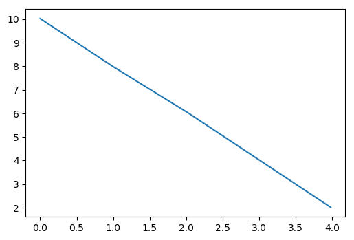
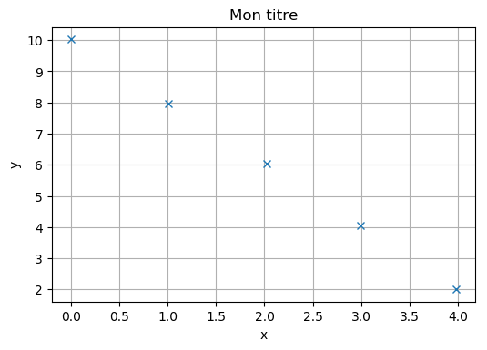
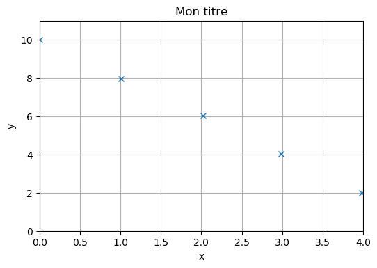
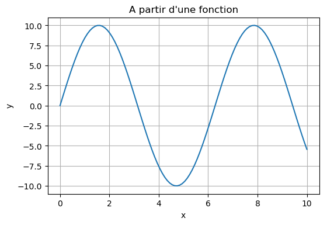
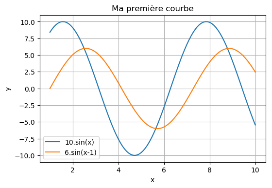

==============================
Les graphiques avec Matplotlib
==============================

Matplotlib est une librairie Python pour la visualisation de courbes.

Site Web officiel de Matplotlib : https://matplotlib.org/

Référence de l'API de la collection *pyplot* de la librairie  *matplotlib* :

https://matplotlib.org/api/_as_gen/matplotlib.pyplot.html#module-matplotlib.pyplot

Tracer une courbe à partir de données
=====================================

Les bases
~~~~~~~~~

.. code-block:: python

   import numpy as np
   import matplotlib.pyplot as plt
   
   x = np.array([0,1.01,2.02,2.99,3.98])     # Données en abscisse
   y = np.array([10.02,7.96,6.03,4.04,2.01]) # Données en ordonnée

   plt.plot(x,y)       # Tracé de la courbe
   plt.show()          # Affichage de la courbe
   

* La collection ``pyplot`` du module ``matplotlib`` est importée avec l'alias ``plt``.
* La fonction ``plot()`` trace la courbe ``y=f(x)`` à partir des tableaux ``x`` et ``y``.
* La fonction ``show()`` appelée en dernier affiche la fenêtre graphique.

Ajouter un titre, une légende, une grille
~~~~~~~~~~~~~~~~~~~~~~~~~~~~~~~~~~~~~~~~~

.. code-block:: python

   import numpy as np
   import matplotlib.pyplot as plt
   
   x = np.array([0,1.01,2.02,2.99,3.98])     # Données en abscisse
   y = np.array([10.02,7.96,6.03,4.04,2.01]) # Données en ordonnée
   
   plt.plot(x,y,'x')       # Tracé de la courbe
   plt.title('Mom titre')  # Ajout d'un titre
   plt.xlabel('x')         # Nom de la grandeur en abscisse
   plt.ylabel('y')         # Nom de la grandeur en ordonnée
   plt.grid()              # Ajout d'une grille
   plt.show()              # Affichage

* Le paramètre ``x`` dans ``plot()`` met en évidence les points par des croix sans les relier par des segments de droite.
* Les fonctions ``title()``, ``xlabel`` et ``ylabel()`` pour ajouter une titre et les légendes sur les axes.
* La fonction ``grid()`` ajoute une grille.

Définir l'échelle
~~~~~~~~~~~~~~~~~

.. code-block:: python

   import numpy as np
   import matplotlib.pyplot as plt
   
   
   x = np.array([0,1.01,2.02,2.99,3.98])     # Données en abscisse
   y = np.array([10.02,7.96,6.03,4.04,2.01]) # Données en ordonnée
   
   
   plt.plot(x,y,'x')       # Tracé de la courbe
   plt.title('Mon titre')  # Ajout d'un titre
   plt.xlabel('x')         # Nom de la grandeur en abscisse
   plt.xlim(0,4)           # Echelle sur l'axe des x
   plt.ylabel('y')         # Nom de la grandeur en ordonnée
   plt.ylim(0,11)          # Echelle sur l'axe des y
   plt.grid()              # Ajout d'une grille
   plt.show()              # Affichage

Tracer une courbe à partir d'une fonction
=========================================

.. code-block:: python

   import numpy as np
   import matplotlib.pyplot as plt
   
   x = np.linspace(0,10,100)   # Création d'un tableau de valeurs pour x
   y = 10*np.sin(x)            # Calcul de y à partir de la fonction mathématique
   
   plt.plot(x,y)                        # Tracé de la courbe
   plt.title("A partir d'une fonction") # Titre
   plt.xlabel('x')                      # Légende abscisse
   plt.ylabel('y')                      # Légende ordonnée
   plt.grid()                           # Ajout d'une grille
   plt.show()                           # Affichage

.. code-block:: python

   import numpy as np
   import matplotlib.pyplot as plt
   
   x = np.linspace(1,10,100)   # Création d'un tableau de valeurs pour x
   y1 = 10*np.sin(x)           # Calcul de y1
   y2 =  6*np.sin(x-1)         # Calcul de y2
   
   plt.plot(x,y1,label='10.sin(x)')   # Tracé de la courbe y1 avec texte légende
   plt.plot(x,y2,label='6.sin(x-1)')  # Tracé de la courbe y1 avec texte légende
   plt.title('Ma première courbe')    # Titre
   plt.xlabel('x')                    # Légende abscisse
   plt.ylabel('y')                    # Légende ordonnée
   plt.legend()                       # Ajout de la légende
   plt.grid()                         # Ajout d'une grille
   plt.show()                         # Affichage

Dans la fonction ``plot()``, le paramètre ``label='...'`` permet d'ajouter une étiquette dans la légende.
