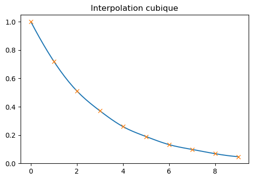
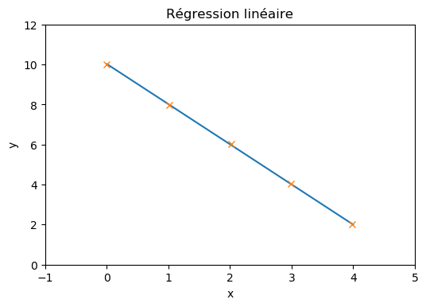
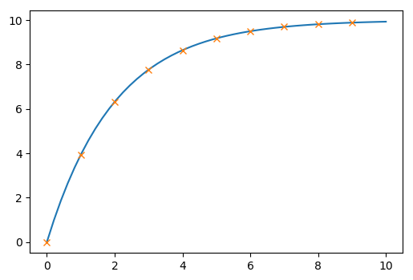

=================================
Le calcul scientifique avec Scipy
=================================

Site Web officiel de Numpy :

https://www.scipy.org/

Documentation de  Scipy :

https://docs.scipy.org/doc/

Interpolation
=============

:Code Python:

.. code:: python

   import numpy as np
   import matplotlib.pyplot as plt
   from scipy import interpolate
   
   x=np.array([0,1,2,3,4,5,6,7,8,9])
   y=np.array([1.,0.720,0.511,0.371,0.260,0.190,0.133,0.099,0.069,0.048])
   
   
   f = interpolate.interp1d(x, y, kind='cubic')
   
   xnew = np.linspace(0,9,50)
   ynew = f(xnew)   # use interpolation function returned by `interp1d`
   plt.plot(xnew, ynew, '-')
   plt.plot(x, y, 'x')
   plt.show()

Régression linéaire
===================

:Code Python:

.. code:: python

   import numpy as np
   import matplotlib.pyplot as plt
   from scipy.stats import linregress
   
   x = np.array([0,1.01,2.02,2.99,3.98])
   y = np.array([10.02,7.96,6.03,4.04,2.01])
   
   # Regression linéaire
   a,b,rho,_,_ = linregress(x,y)
   print("a = ",a)
   print("b = ",b)
   print("rho = ",rho)
   
   xnew = np.linspace(0,4,50)
   ynew = a*xnew+b
   
   plt.plot(xnew,ynew,'-',x,y,'x')
   plt.title('Régression linéaire')
   plt.xlabel('x')
   plt.xlim(-1,5)
   plt.ylabel('y')
   plt.ylim(0,12)
   plt.show()

:Résultats:

.. code::

   a =  -2.0059103329622507
   b =  10.023820665924502
   rho =  -0.9999253712412117
   

* ``rho`` est le coefficient de corrélation linéaire.

Modélisation à partir d'une fonction
====================================

:Code Python:

.. code:: python

   import numpy as np
   import matplotlib.pyplot as plt
   from scipy.optimize import curve_fit
   
   x=np.array([0,1,2,3,4,5,6,7,8,9])
   y=np.array([0.,3.935,6.321,7.769,8.647,9.179,9.502,9.698,9.817,9.889])
   
   
   def fct(x,A,tau):
       return A*(1-np.exp(-x/tau))
   
   (A,tau), pcov = curve_fit(fct,x,y)
   print("A= ",A)
   print("tau=",tau)
   
   xnew = np.linspace(0,10,50)
   ynew = fct(xnew,A,tau)
   plt.plot(xnew, ynew, '-')
   plt.plot(x, y, 'x')
   plt.show()

:Résultats:

.. code::

   A=  9.99999510282223
   tau= 1.9999259182304618
   

