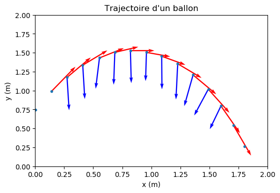

================================================
Mouvement d'un point : vecteur variation vitesse
================================================

.. topic:: Programme de première générale - Enseignement de spécialité - 2019

   "Utiliser un langage de programmation pour étudier la relation approchée entre la variation du vecteur vitesse d’un système modélisé par un point matériel entre deux instants voisins et la somme des forces appliquées sur celui-ci".

Programme Python
================

.. code-block:: python

   import numpy as np
   import matplotlib.pyplot as plt
   plt.rcParams['figure.dpi'] = 100

   dt = 0.066
   x = np.array([0.003,0.141,0.275,0.410,0.554,0.686,0.820,0.958,1.089,1.227,1.359,1.490,1.599,1.705,1.801])
   y = np.array([0.746,0.990,1.175,1.336,1.432,1.505,1.528,1.505,1.454,1.355,1.207,1.018,0.797,0.544,0.266])
   N = x.size

   vx = np.zeros(N)
   vy = np.zeros(N)
   for i in range(1,N-1):
       vx[i] = (x[i+1]-x[i-1])/(2*dt)
       vy[i] = (y[i+1]-y[i-1])/(2*dt)

   #print(vx.round(2))
   #print(vy.round(2))

   dvx = np.zeros(N)
   dvy = np.zeros(N)
   for i in range(2,N-2):
       dvx[i] = vx[i+1]-vx[i-1]
       dvy[i] = vy[i+1]-vy[i-1]

   #print(dvx.round(2))
   #print(dvy.round(2))

   plt.xlabel('x (m)')
   plt.xlim(0,2)
   plt.ylabel('y (m)')
   plt.ylim(0,2)
   plt.title('Trajectoire d\'un ballon')
   plt.plot(x,y,'.')
   plt.quiver(x,y,vx,vy,angles='xy',scale_units='xy',scale=10,color='red',width=0.005)
   plt.quiver(x,y,dvx,dvy,angles='xy',scale_units='xy',scale=3,color='blue',width=0.005)
   plt.show()

:Résultats:

