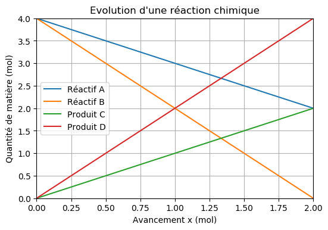

===============================
Évolution d'un système chimique
===============================

.. topic:: Programme de première générale - Enseignement de spécialité - 2019

   "Déterminer la composition de l’état final d’un système siège d’une transformation chimique totale à l’aide d’un langage de programmation.

Cas 1
=====

.. code-block:: python

   import numpy as np
   import matplotlib.pyplot as plt

   a,b,c,d = 1,2,1,2           # Nombres stoechiométriques
   niA,niB,niC,niD = 4,4,0,0   # quantité de matière initiale de l'espèce chimique A

   # Calcul de l'avancement maximal xMax
   xMax1 = niA/a
   xMax2 = niB/b
   if (xMax1<xMax2):
       xMax = xMax1
       print("L'espèce A est la réactif limitant donc xmax = ", xMax, " mol")
   elif (xMax2<xMax1):
       xMax = xMax2
       print("L'espèce B est la réactif limitant donc xmax = ", xMax, " mol")
   else:
       xMax = xMax1
       print("Les espèces A et B sont tous les deux réactifs limitant donc xmax = ", xMax, " mol")
       print("Les espèces A et B sont en proportion stoechiométrique !")

   # Tracé de l'évolution du système chimique

   x = np.linspace(0,xMax,10)
   nA = niA-a*x
   nB = niB-b*x
   nC = niC+c*x
   nD = niD+d*x

   plt.title("Evolution d'une réaction chimique")
   plt.xlabel("Avancement x (mol)")
   plt.xlim(0,xMax)
   plt.ylabel("Quantité de matière (mol)")
   plt.ylim(0,4)
   plt.plot(x,nA,label = "Réactif A")
   plt.plot(x,nB,label = "Réactif B")
   plt.plot(x,nC,label = "Produit C")
   plt.plot(x,nD,label = "Produit D")
   plt.legend()
   plt.grid()
   plt.show()

:Résultats:

.. code::

   L'espèce B est la réactif limitant donc xmax =  2.0  mol

.. code-block:: python

Cas 2
=====

On considère la réaction totale entre l’hydrogène sulfureux (H 2 S) et le dioxyde de soufre (SO 2 ) qui produit du
soufre et de l’eau et modélisée par l’équation :

.. math::

   2 H_2S + SO_2 -> 3 S + 2 H_2O

.. code-block:: python

   a = 2 # coefficient stoechiométrique de H2S
   b = 1
   c = 3
   d = 2

   n0_H2S = float(input("Donne le nombre de moles de H2S : "))
   n0_SO2 = float(input("Donne le nombre de moles de SO2 : "))
   n0_S   = float(input("Donne le nombre de moles de S : "))
   n0_H2O = float(input("Donne le nombre de moles de H2O : "))

   n_H2S, n_SO2, n_S, n_H2O = n0_H2S, n0_SO2, n0_S, n0_H2O

   dx = 0.01
   x = 0

   while n_H2S>0 and n_SO2>0:
       x = x + dx
       n_H2S = n0_H2S - a*x
       n_SO2 = n0_SO2 - b*x
       n_S   = n0_S   - c*x
       n_H2O = n0_H2O - d*x

   print('Avancement final = ',x, ' mol')
   print('n(H2S) = ', n_H2S)
   print('n(SO2) = ', n_SO2)
   print('n(S) = ', n_S)
   print('n(H2O) = ', n_H2O)
