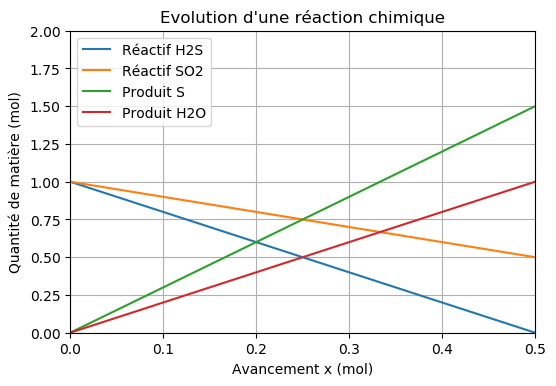

===============================
Évolution d'un système chimique
===============================

.. topic:: Programme de première générale - Enseignement de spécialité - 2019

   "Déterminer la composition de l’état final d’un système siège d’une transformation chimique totale à l’aide d’un langage de programmation.

Exemple de réaction chimique
============================

On considère la réaction totale entre l’hydrogène sulfureux (H 2 S) et le dioxyde de soufre (SO 2 ) qui produit du
soufre et de l’eau et modélisée par l’équation :

.. math::

   2 H_2S + SO_2 -> 3 S + 2 H_2O

Etat final
==========

.. code-block:: python

   a,b,c,d = 2, 1, 3, 2                      # coefficient stoechiométrique de H2S
   n_H2S, n_SO2, n_S, n_H2O = 1, 1, 0, 0     # Quantités de matière initiales

   x = 0           # Initialisation de l'avancement
   dx = 0.01       # Pas de l'avancement

   while n_H2S>0 and n_SO2>0:
       x = x + dx               # Incrémentation de l'avancement
       n_H2S = n_H2S - a*dx     # Nouvelle quantité de matière
       n_SO2 = n_SO2 - b*dx
       n_S   = n_S   + c*dx
       n_H2O = n_H2O + d*dx

   print('Avancement final = ',round(x,2), ' mol')
   print('n(H2S) = ', round(n_H2S,2))
   print('n(SO2) = ', round(n_SO2,2))
   print('n(S) = ',   round(n_S,2))
   print('n(H2O) = ', round(n_H2O,2))

:Résultats:

.. code-block:: python

   Avancement final =  0.5  mol
   n(H2S) =  -0.0
   n(SO2) =  0.5
   n(S) =  1.5
   n(H2O) =  1.0

Evolution des quantités de matière
==================================

.. code-block:: python

   import matplotlib.pyplot as plt

   a,b,c,d = 2, 1, 3, 2                      # coefficient stoechiométrique de H2S
   n_H2S, n_SO2, n_S, n_H2O = 1, 1, 0, 0     # Quantités de matière initiales
   n_H2S, n_SO2, n_S, n_H2O = [n0_H2S], [n0_SO2], [n0_S], [n0_H2O]   # Initialisation des tableaux
   x = [0]
   dx = 0.01

   while n_H2S[-1]>0 and n_SO2[-1]>0:
       x.append(x[-1] + dx)
       n_H2S.append(n_H2S[-1] - a*dx)
       n_SO2.append(n_SO2[-1] - b*dx)
       n_S.append(n_S[-1]   + c*dx)
       n_H2O.append(n_H2O[-1] + d*dx)

   xMax = x[-1]

   plt.title("Evolution d'une réaction chimique")
   plt.xlabel("Avancement x (mol)")
   plt.xlim(0,xMax)
   plt.ylabel("Quantité de matière (mol)")
   plt.ylim(0,2)
   plt.plot(x,n_H2S,label = "Réactif H2S")
   plt.plot(x,n_SO2,label = "Réactif SO2")
   plt.plot(x,n_S,label = "Produit S")
   plt.plot(x,n_H2O,label = "Produit H2O")
   plt.legend()
   plt.grid()
   plt.show()

:résultats:

