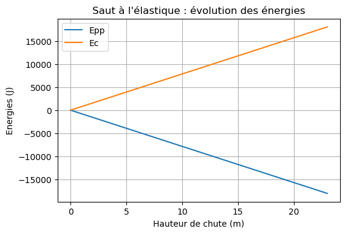
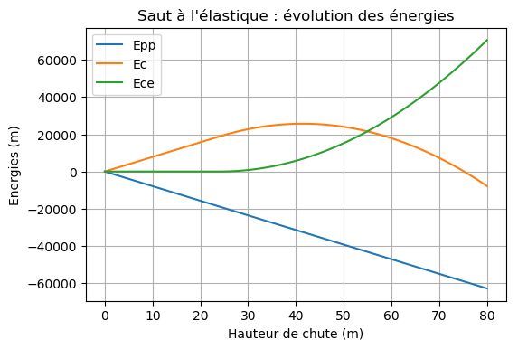

===========================================
Bilan énergétique d'un mouvement rectiligne
===========================================

.. topic:: Programme de première générale - Enseignement de spécialité - 2019

   "Utiliser un langage de programmation pour effectuer le bilan énergétique d’un système en mouvement".

Principe
========

Étude d'un saut à l'élastique à partir d'une ressource EDUSCOL.

http://cache.media.education.gouv.fr/file/Programmer_en_physique-chimie/12/5/RA18_Lycee_PHCH_etude-energetique-mouvement-rectiligne_1044125.pdf

Avant que l'élastique soit tendu
================================

:Script Python:

.. code:: python

   import matplotlib.pyplot as plt
   plt.rcParams['figure.dpi'] = 100

   m,g,h0 = 80,9.81,0

   Epp=[-m*g*h0]
   Ec=[m*g*h0]
   H=[h0]

   for h in range(0,24):
       H.append(h)
       Epp.append(-m*g*h)
       Ec.append(m*g*h)

   plt.plot(H,Epp,label='Epp')
   plt.plot(H,Ec,label='Ec')
   plt.xlabel('Hauteur de chute (m)')
   plt.ylabel('Energies (J)')
   plt.title("Saut à l'élastique : évolution des énergies")
   plt.legend()
   plt.grid()
   plt.show()

:Résultats:

Chute complète
==============

:Script Python:

.. code:: python

   import matplotlib.pyplot as plt
   plt.rcParams['figure.dpi'] = 100

   m,g,h0,l0,k = 80,9.81,0,24,45

   Epp=[-m*g*h0]
   Ec=[m*g*h0]
   Epe=[0]
   H=[h0]

   for h in range(1,81):
       H.append(h)
       Epp.append(-m*g*h)
       if h<l0:
           Epe.append(0)
           Ec.append(m*g*h)
       else:
           Epe.append(0.5*k*(h-l0)**2)
           Ec.append(m*g*h-0.5*k*(h-l0)**2)

   plt.plot(H,Epp,label='Epp')
   plt.plot(H,Ec,label='Ec')
   plt.plot(H,Epe,label='Ece')
   plt.legend()
   plt.title("Saut à l'élastique : évolution des énergies")
   plt.xlabel('Hauteur de chute (m)')
   plt.ylabel('Energies (m)')
   plt.grid()
   plt.show()

:Résultats:

Chute complète avec calcul de longueur maximale
===============================================

:Script Python:

.. code:: python

   Bientôt !

:Résultats:
