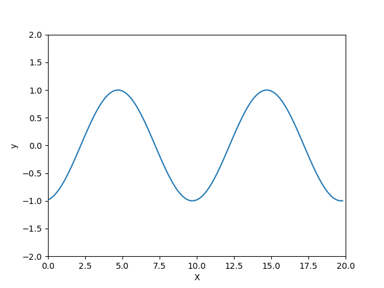

=================================
Simuler la propagation d'une onde
=================================

.. topic:: Programme de première générale - Enseignement de spécialité - 2019

   "Simuler à l’aide d’un langage de programmation, la propagation d’une onde périodique".

:Script Python:

.. code:: python

   from math import sin, pi
   import matplotlib.pyplot as plt
   from matplotlib import animation

   Xmax=20.0
   Tmax=10.0
   Ne = 100

   positionsX = [i*Xmax/Ne for i in range(Ne)]
   temps = [i*Tmax/Ne for i in range(Ne)]

   T=5
   v=2

   mescourbes = [[sin(2*pi/T*(t-x/v)) for x in positionsX ] for t in temps]

   fig = plt.figure()
   ax = plt.axes(xlim=(0,Xmax),ylim=(-2,2))
   plt.xlabel('X')
   plt.ylabel('y')
   courbe, = ax.plot(positionsX,mescourbes[0])

   def incrementeTemps(i):
       courbe.set_ydata(mescourbes[i])
       return courbe

   line_ani = animation.FuncAnimation(fig, incrementeTemps, 100, interval=100, blit=False)

   plt.show()

:Résultats:

