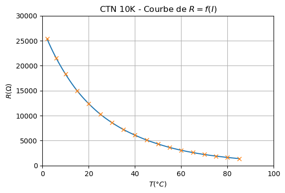

===========================
Caractéristique d'un dipôle
===========================

.. topic:: Programme de seconde générale et technologique 2019.

   "représenter un nuage de points associé à la caractéristique d’un dipôle et modéliser la caractéristique de ce dipôle à l’aide d’un langage de programmation".

Cas d'un capteur de température NTC 10K type EKS 221.

http://files.danfoss.com/technicalinfo/dila/01/RD8KC304_EKS221.pdf

:Script Python:

.. code:: python

   import numpy as np
   import matplotlib.pyplot as plt
   plt.rcParams['figure.dpi'] = 100
   from scipy import interpolate

   T = np.array([2, 6, 10, 15, 20, 25, 30, 35, 40, 45, 50.1, 55, 60, 65, 70, 75, 80, 85])
   R = np.array([25378,21487,18301,14990,12402,10295,8615,7226,6097,5121,4306,3632,3070,2609,2221,1903,1630,1404])

   #Interplotation
   f = interpolate.interp1d(T, R, kind='cubic')
   Tnew = np.linspace(T.min(),T.max(),100)
   Rnew = f(Tnew)

   plt.title('$R=f(T)$')
   plt.xlabel('$T(°C)$')
   plt.xlim(0,100)
   plt.ylabel('$R(\Omega)$')
   plt.ylim(0,30000)
   plt.plot(Tnew,Rnew)
   plt.plot(T,R,'x')
   plt.grid()
   plt.show()

:Résultats:

