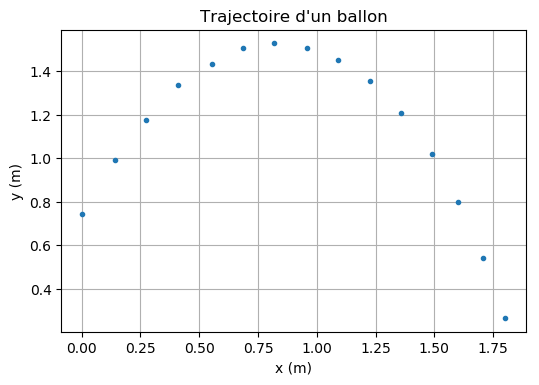

================================
Mouvement d'un point : positions
================================
.. topic:: Programme de seconde générale et technologique 2019.

   "Représenter les positions successives d’un système modélisé par un point lors
   d’une évolution unidimensionnelle ou bidimensionnelle à l’aide d’un langage de programmation".

Les données sont obtenues à partir de l'exploitation d'une chronophotographie du lancer d'un ballon.

:Script Python:

.. code:: python

   import numpy as np
   import matplotlib.pyplot as plt

   x = np.array([0.003,0.141,0.275,0.410,0.554,0.686,0.820,0.958,1.089,1.227,1.359,1.490,1.599,1.705,1.801])
   y = np.array([0.746,0.990,1.175,1.336,1.432,1.505,1.528,1.505,1.454,1.355,1.207,1.018,0.797,0.544,0.266])

   plt.plot(x,y,'.')
   plt.xlabel('x (m)')
   plt.ylabel('y (m)')
   plt.grid(True)
   plt.title('Trajectoire d\'un ballon')
   plt.show()

:Résultats:

