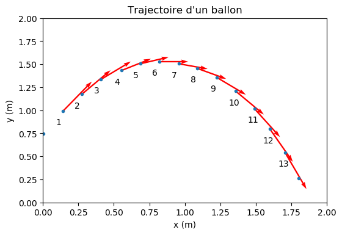

======================================
Mouvement d'un point : vecteur vitesse
======================================

.. topic:: Programme de seconde générale et technologique 2019.

   "Représenter des vecteurs vitesse d’un système modélisé par un point lors d’un mouvement à l’aide d’un langage de programmation".

:Script Python:

.. code:: python

   import numpy as np
   import matplotlib.pyplot as plt
   plt.rcParams['figure.dpi'] = 100

   # Données
   dt = 0.0667
   x = np.array([0.003,0.141,0.275,0.410,0.554,0.686,0.820,0.958,1.089,1.227,1.359,1.490,1.599,1.705,1.801])
   y = np.array([0.746,0.990,1.175,1.336,1.432,1.505,1.528,1.505,1.454,1.355,1.207,1.018,0.797,0.544,0.266])

   # Calculs des vecteurs vitesses
   N = len(x)         # Nombre de points de mesures
   vx = np.zeros(N)   # Initialisation d'un tableau vide
   vy = np.zeros(N)   # Idem
   for i in range(1,N-1):
       vx[i]=(x[i+1]-x[i-1])/(2*dt)
       vy[i]=(y[i+1]-y[i-1])/(2*dt)

   # Calcul des vitesses
   v = np.sqrt(vx**2+vy**2)

   plt.plot(x,y,'.')
   plt.xlabel('x (m)')
   plt.xlim(0,2)
   plt.ylabel('y (m)')
   plt.ylim(0,2)
   plt.title('Trajectoire d\'un ballon')
   plt.quiver(x,y,vx,vy,angles='xy',scale_units='xy',scale=10,color='red',width=0.005)
   for i in range(1,N-1):
       plt.annotate(i,(x[i]-0.05,y[i]-0.15))
       print('Point',i,'-> v=',round(v[i],2)," m/s")
   plt.show()

:Résultats:

.. code::

   Point 1 -> v= 3.81  m/s
   Point 2 -> v= 3.29  m/s
   Point 3 -> v= 2.84  m/s
   Point 4 -> v= 2.43  m/s
   Point 5 -> v= 2.12  m/s
   Point 6 -> v= 2.04  m/s
   Point 7 -> v= 2.09  m/s
   Point 8 -> v= 2.31  m/s
   Point 9 -> v= 2.74  m/s
   Point 10 -> v= 3.2  m/s
   Point 11 -> v= 3.56  m/s
   Point 12 -> v= 3.9  m/s
   Point 13 -> v= 4.26  m/s

