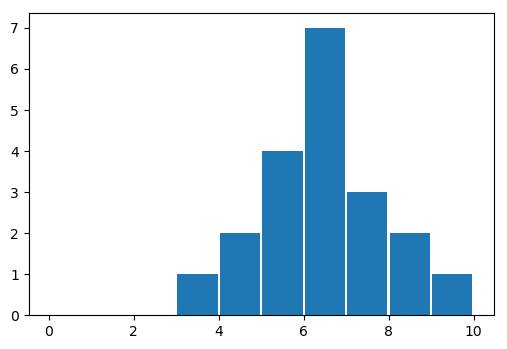
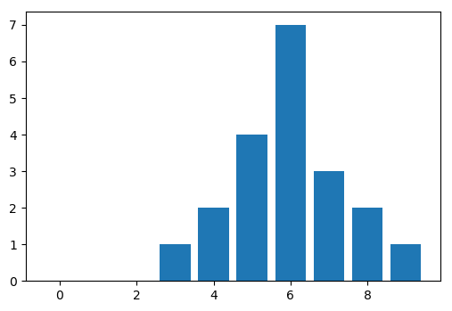
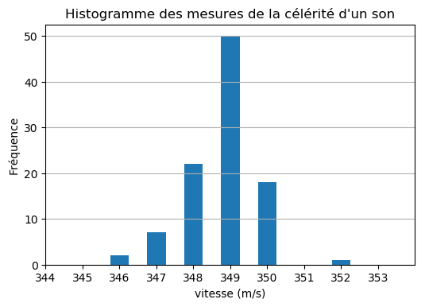

================================
Histogramme d'un série de mesure
================================

.. topic:: Programme de classe terminale, enseignement de spécialité, voie générale

   Représenter l’histogramme associé à une série de mesures à l’aide d’un tableur ou d'un langage de programmation.

Principe
========

Le module **matplolib** propose la fonction ``hist()`` pour l'affichage d'un **histogramme** à partir d'un tableau de mesures.

La documentation officielle de cette fonction se trouve `ici <https://matplotlib.org/3.1.1/api/_as_gen/matplotlib.pyplot.hist.html>`_

Exemple 1
---------

.. code-block:: python

   import numpy as np
   import matplotlib.pyplot as plt

   x = [5,6,4,7,6,7,6,8,6,5,6,5,3,9,4,6,5,8,7,6]

   plt.hist(x,range=(0,10),bins=10,rwidth = 0.95)
   plt.show()

:Résultats:

Les options de la fonction ``hist()`` :

* ``range(0,10)`` fixe les limites de la plage d'étude du tableau de données.
* ``bins=10`` est le nombre d'intervalles dans la plage d'étude.
* ``rwidth = 0.95`` fixe la largeur des barres à 95%.

Exemple 2
---------

.. code-block:: python

   import numpy as np
   import matplotlib.pyplot as plt

   x = [5,6,4,7,6,7,6,8,6,5,6,5,3,9,4,6,5,8,7,6]

   freq,valx,opt = plt.hist(x,range=(0,10),bins=10,rwidth = 0.8, align='left')
   plt.show()

   print("Valeur moyenne = ", np.mean(x))
   print("Ecart type = ",np.std(x).round(2))
   print('frequence = ',freq)
   print('valeurs x = ',valx)

:Résultats:

.. code-block:: python

   Valeur moyenne =  5.95
   Ecart type =  1.4309
   frequence =  [0. 0. 0. 1. 2. 4. 7. 3. 2. 1.]
   valeurs x =  [ 0.  1.  2.  3.  4.  5.  6.  7.  8.  9. 10.]

* L'option ``align='left'`` permet de centrer les barres.
* Les fonctions du module Numpy ``mean()`` est ``std()`` calculent respectivement la valeur moyenne et l'écart type.

.. note::

   Le module ``scipy.stats`` fournit un grand nombre de lois de probabilités (Bernoulli, binomiale, normale, ...) et diverses méthodes de calcul (moyenne, médiane, variance, écart type, ...).

   Voir la page `Python pour le calcul scientifique/Statistiques <https://fr.wikibooks.org/wiki/Python_pour_le_calcul_scientifique/Statistiques>`_ sur WikiBooks

Exemples : mesures de la célérité d'un son
==========================================

A l'aide d'un émetteur-récepteur ultrasons du type HC-SR04, un microcontrôleur Arduino effectue plusieurs fois la mesure de la célérité du son dans l'air.

Expérimentation
---------------

Le programme Arduino utilisé pour obtenir dans le moniteur série du logiciel Arduino les mesures au format CSV est donné ci-dessous.

.. code-block:: arduino

   /*
    * Mesure de la célérité du son au format CSV
    * avec un microntrôleur EducaduinoLab
    */

   #define pinTrig 19      // Module ultrason sur
   #define pinEcho 18      // les broches D18/D19

   float distance = 1.735; // Distance en module et réflecteur
   long  dureeEcho;        // Durée mesurée
   float celerite;         // célérité calculée
   int n=1;                // Initialisation du compteur

   void setup() {
     pinMode(pinTrig,OUTPUT);      // Broche Trig en sortie
     digitalWrite(pinEcho,LOW);    // Sortie Trig à l état bas
     pinMode(pinEcho,INPUT);       // Broche Echo en entrée
     Serial.begin(9600);           // Paramétrage du port série
     Serial.println("n;duree;v");  // Ecriture première ligne du CSV
   }

   void loop() {
     if (n<=100) {
     digitalWrite(pinTrig,HIGH);            // Déclenchement d'une mesure
     delayMicroseconds(10);                 // Attendre 10 microseconde
     digitalWrite(pinTrig,LOW);             // Fin impulsion (Etat bas)
     dureeEcho = pulseIn(pinEcho,HIGH);     // Mesure de la durée de l impulsion sur Echo
     celerite = 2*distance/dureeEcho*1E6;   // Calcul de la célérité
     Serial.print(n);                       // Début écriture ligne CSV
     Serial.print(";");
     Serial.print(dureeEcho);
     Serial.print(";");
     Serial.println(celerite);              // Fin écriture ligne CSV
     delay(100);                            // Attendre 100 ms
     n++;                                   // Incrémentation du compteur
     }
   }

Le fichier CSV obtenu pour 100 mesures est téléchargeable ici :download:`data_son.txt <csv/data_son.txt>`.

Voici un extrait du fichier CSV des 30 premières mesures :

.. code-block:: csv

   n;duree;v
   1;9853;352.18
   2;9934;349.31
   3;9901;350.47
   4;9933;349.34
   5;9902;350.43
   6;9901;350.47
   7;9928;349.52
   8;9928;349.52
   9;9955;348.57
   10;9928;349.52
   11;9934;349.31
   12;9928;349.52
   13;9928;349.52
   14;9933;349.34
   15;9927;349.55
   16;9980;347.70
   17;9928;349.52
   18;9929;349.48
   19;9934;349.31
   20;9954;348.60
   21;9901;350.47
   22;9928;349.52
   23;9954;348.60
   24;9934;349.31
   25;9955;348.57
   26;9928;349.52
   27;9934;349.31
   28;9929;349.48
   29;9956;348.53
   30;9954;348.60

Programme Python
----------------

.. warning::

   Le programme Python et le fichier CSV sont à **enregistrer dans le même répertoire de travail** !

.. code-block:: python

   import numpy as np
   import matplotlib.pyplot as plt

   # Importation des données au format CSV
   n,duree,v = np.loadtxt("data_son.txt",delimiter=';',skiprows=1, unpack=True)

   # Calcul des fréquences et affichage de l'histogramme
   plt.hist(v,range=(344,354),bins=10,align='left',rwidth=0.5)

   # Paramétrage de l'affichage
   plt.xlabel('célérité (m/s)')
   plt.xlim(344,354)
   plt.xticks(np.arange(344,354,1))
   plt.ylabel('Fréquence')
   plt.grid(axis='y')
   plt.title("Histogramme des mesures de la célérité d'un son")
   plt.show()

.. code-block:: python

   Valeur moyenne =  349.3
   Ecart type =  0.8961
