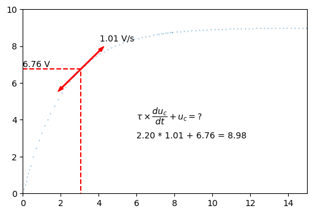

======================================
Solution d'une équation différentielle
======================================

.. topic:: BTS Électrotechnique

   Animation vérifiant la solution d'une équation différentielle du premier ordre.

:Script Python:

.. code:: python

   import numpy as np
   import matplotlib.pyplot as plt
   plt.rcParams['figure.dpi'] = 150
   
   #tps,u,uc,i = np.loadtxt('data_ltspice.txt',delimiter='\t',unpack=True,skiprows=1)
   tps,u,uc = np.loadtxt('data_oscillo.csv',delimiter=',',unpack=True,skiprows=2)
   
   tau = 2.2
   
   
   
   for n in range(10,90,1):
       a = (uc[n+1]-uc[n-1])/(tps[n+1]-tps[n-1])
       E = tau*a+uc[n]
       text1 = '%.3f V/s' % a
       text2 = '%.2f V' % uc[n]
       text3 = r'$\tau\times\dfrac{du_c}{dt} + u_c = ?$'
       text4 = '%.2f' % tau + ' * %.3f' % a + ' + %.2f' % uc[n] + ' = %.2f' % E
       plt.clf()
       plt.xlim(0,20)
       plt.ylim(0,10)
       plt.plot(tps,uc,'.',markersize=0.5)
       plt.arrow(tps[n],uc[n],1,a,color='r',width=0.05,head_width=0.2)
       plt.arrow(tps[n],uc[n],-1,-a,color='r',width=0.05,head_width=0.2)
       plt.annotate(text1,(tps[n]+1,uc[n]+a+0.5))
       plt.plot([0,tps[n],tps[n]],[uc[n],uc[n],0],'r--')
       plt.annotate(text2,(0,uc[n]+0.1))
       plt.annotate(text3,(6,4))
       plt.annotate(text4,(6,3))
       plt.pause(2)
      
   plt.show()

:Résultats:

