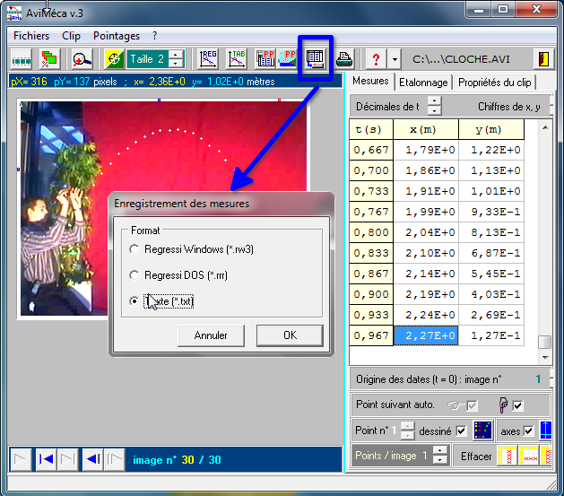
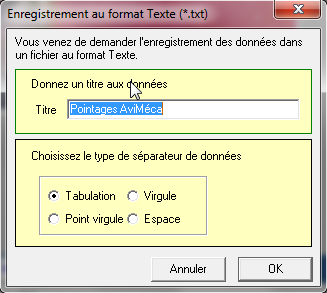
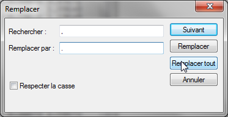
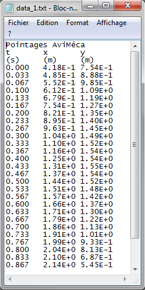
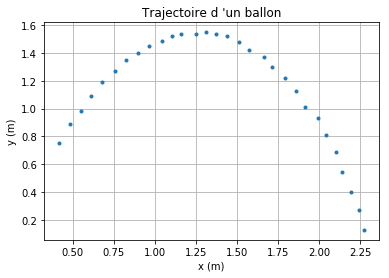

===================================================
Importer dans Python des données à partir d'AviMeca
===================================================

AviMeca, comme le plupart des logiciels utilisés en physique-chimie, offre la possibilité d'exporter les mesures dans un fichier texte (avec l'extension ``.txt`` au format CSV). Il est ainsi possible d'exploiter directement les données dans Python sans avoir à les recopier manuellement dans le script !

Étape 1 : Exporter les mesures dans un fichier texte
====================================================

Une fois les mesures effectuées, cliquer sur l’icône d'enregistrement de mesures (voir figure ci-dessous) et choisir  ``Texte (*.txt)``.

Dans la fenêtre suivante, ajouter un titre (éviter les accents !) et garder la tabulation comme séparateur (plus lisible).

Puis enregistrer le fichier (par exemple avec le nom ``data.txt``).

Étape 2 : Adapter le fichier
============================
Ouvrir le fichier obtenu avec un éditeur texte (exemple. Bloc-note, Wordpad, Wordpad++...).

Il faut maintenant adapter les nombres décimaux au système anglo-saxon, c'est à dire remplacer toutes les virgules par des points !

Dans la boite de dialogue "Remplacer" (dans le menu édition) :
   * compléter le champ "Rechercher" avec le caractère ``,`` ;
   * le champ "Remplacer par" avec le caractère ``.`` ;
   * puis cliquer sur "Remplacer tout".

On obtient alors le contenu suivant :

Enregistrer le fichier pour prendre en compte les modifications.

Étape 3 : Importer les données dans Python
==========================================

La fonction ``loadtxt`` du module ``numpy`` se chargera d'importer les données du fichier ``data.txt`` dans Python.

.. warning:: Le fichier ``data.txt`` doit figurer dans le même répertoire que le programme Python.

D'après l'analyse du fichier texte, il faudra ajouter les options suivantes à la fonction ``loadtxt()``:

===================  ====================================================
``delimiter ='\t'``  Tabulation comme séparateur.
``skiprows=1``       Sauter les trois premières lignes (commentaires).
``unpack=True``      Les données sont en colonnes (en lignes par défaut).
===================  ====================================================

Ce qui donne pour la fonction ``loadtxt()`` :

.. code-block :: python

   t, x, y = np.loadtxt('data.txt',delimiter='\t',skiprows=3, unpack=True)

Et voici le programme complet :

.. code-block :: python

   import numpy as np
   import matplotlib.pyplot as plt

   t, x, y = np.loadtxt('data.txt',delimiter='\t',skiprows=3, unpack=True)

   plt.plot(x,y,'.')
   plt.xlabel('x (m)')
   plt.ylabel('y (m)')
   plt.grid()
   plt.title("Trajectoire d 'un ballon")
   plt.show()

Et la courbe obtenue :

